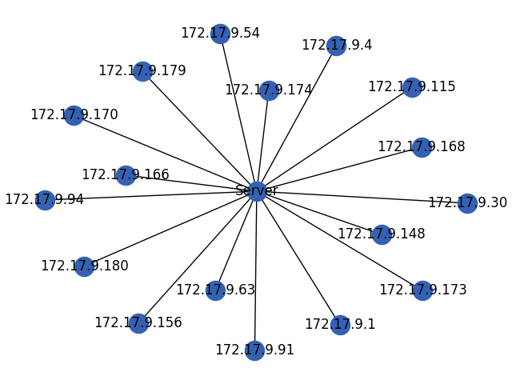

This project has been carried out with the approach of entering into a system and network and opening a socket in the network and by sending an ICMP packet. It identifies the nodes that are active and finally, after identifying these nodes, it identifies the IPs and draws the final graph in the form of a graph that is the main node of the server and all are connected to the server with edges.

The whole implementation is as follows: the program starts working with the sudo command python3 amniat.py

And after the start after the time the processing starts it starts searching based on the IP it is located in

The search operation is such that it creates threads for the number of nodes (hosts) in the network and these threads start to operate.

In each thread, the operation is performed based on the send_icmp function. And this function waits for a response after sending each packet. If it can receive a response, it considers this node as active.

This process is done in the same way and active nodes are identified

And finally the output is displayed as follows:

[*]:root:17 hosts founded

[*]:root:Host found: 172.17.9.1

[*]:root:Host found: 172.17.9.4

[*]:root:Host found: 172.17.9.30

[*]:root:Host found: 172.17.9.54

[*]:root:Host found: 172.17.9.63

[*]:root:Host found: 172.17.9.91

[*]:root:Host found: 172.17.9.94

[*]:root:Host found: 172.17.9.115

[*]:root:Host found: 172.17.9.148

[*]:root:Host found: 172.17.9.156

[*]:root:Host found: 172.17.9.166

[*]:root:Host found: 172.17.9.168

[*]:root:Host found: 172.17.9.170

[*]:root:Host found: 172.17.9.173

[*]:root:Host found: 172.17.9.174

[*]:root:Host found: 172.17.9.179

[*]:root:Host found: 172.17.9.180

And to display the graph, it is saved as a photo file in the same directory

